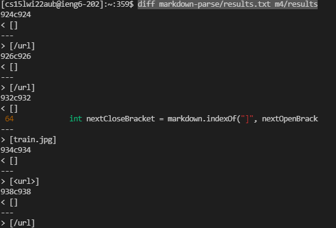
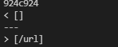
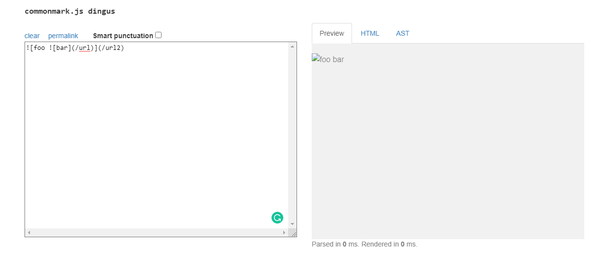
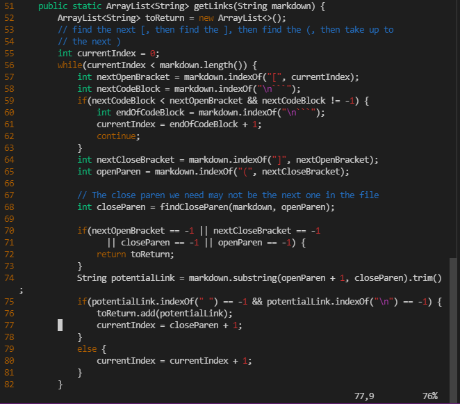
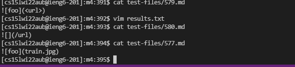
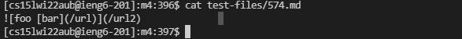

>
# Lab Report 5
>
**Name:Junpeng Li**
>
**Professor Joe**
>
**CSE 15L**
>
___
## Method to find the different results within two results.txt files
>
Actually what I have done is to use `diff` command from the terminal to compare the results that we got from running `bash script.sh` on both implementations.
>
The diff commands is as follow in my ieng6
```
diff markdown-parse/results.txt m4/results
```
(Here markdown-parse directory is my own implementation, and m4 is the rename of Professor's implementation)
>
*Here is the screenshot of the terminal after using the `diff` command*:

>
___
## First Test:
>

>
From this, we can know the output on line 924 inside both results.txt files is different.
>
This test corresponds to the following markdown file:

>
Then I use `cat` command to look for the content within the 573.md file.

>
My own implementation is correct because the content inside this md file is a image link which should return an empty list when we test this file.
>
**Expected output from the preview of a website that can test link format [website](https://spec.commonmark.org/dingus/)**

```
Expected output:
[]
```
>

>
Here is the actual output of both my implementation and professor's implementation.
We can see the output on my program is same as the expected output. Then output of Professor's implementation did not show the same as what we expect.
>
**Bug Description,Part of code needs to fix on Professor's program**
>
This bug is actually caused by an image link. As long as the program did not handle the case of image link 
>

>
Around line 57, the program should handle the sign `!` before the open bracket or somewhere else inside the brackets. Especially, a image link inside the brackets. If the program handles the case of image link, it will return the actual output which is the empty list instead of the link of image path.

## Second Test
Actually, our group has renamed some md files which caused an infinite loop during the bash time. Then what I got on `diff` command is all about the bug of image links. Following are all the md files which has different results on `diff`:

>

>

>

>

>


>
Most likely, these are all about the same bug which is the image link. Honestly, our group have renamed the md files that cause infinite loop. Hence the only difference that I got by running `diff` command are the picture above.
>
Similarly, The expected output for each of the md files should be empty list because they are all image links.
>
Actual Output:
>
.
>
**Code to fix(similar to case 1 because our group only got this bug by running `diff`)**
>

>
Professor's implementation should be fixed to handle the image link and return an empty list whenever the program calls getLink method on an image link.
>

Thank you for reading this lab report(Appreciate to all of you for helping us on everything on this course this quarter)
>

